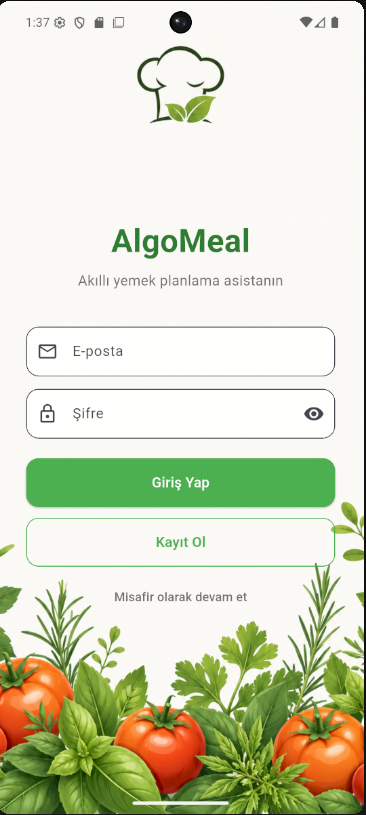
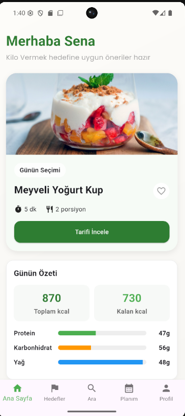
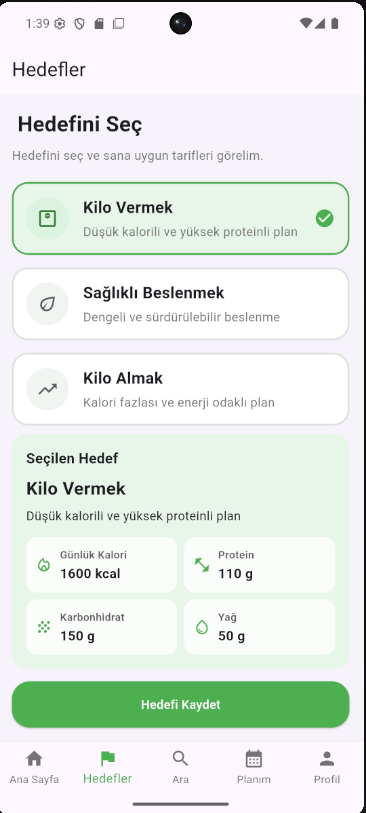
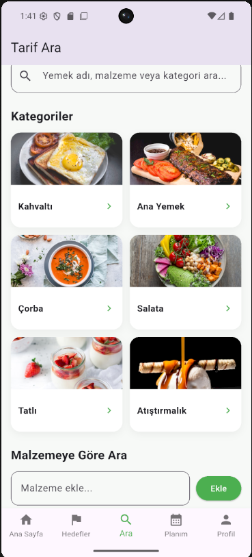
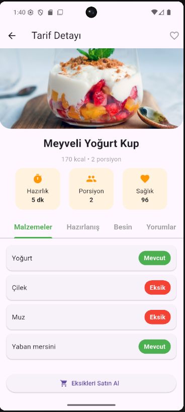
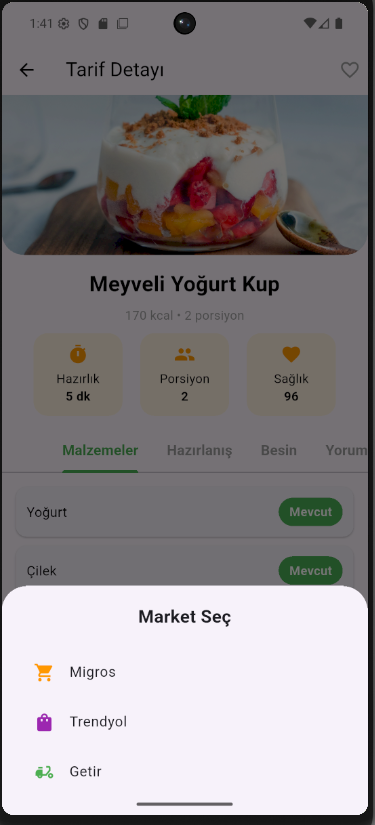
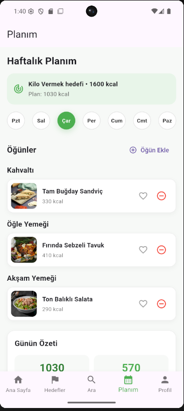
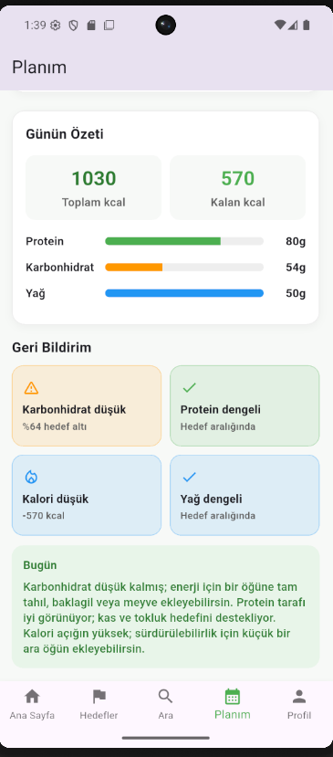
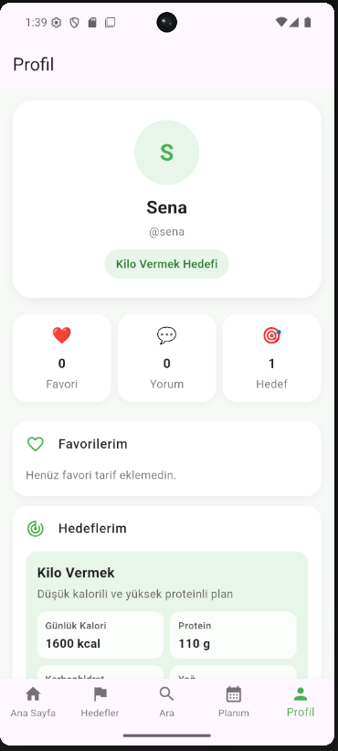

# AlgoMeal

AlgoMeal, kullanıcıların beslenme hedeflerine uygun tarifler keşfetmesini, günlük kalori takibini yapmasını ve haftalık yemek planı oluşturmasını sağlayan Flutter tabanlı akıllı beslenme uygulamasıdır.

## 🚀 Özellikler

- Kişiselleştirilmiş beslenme hedefleri
- Günlük kalori ve makro takibi
- Tarif arama ve kategori filtreleme
- Malzemeye göre tarif önerileri
- Eksik malzemeleri tespit etme
- Haftalık yemek planlayıcı
- Favori tarif sistemi
- Firebase Authentication
- Firebase Firestore entegrasyonu

## 🛠️ Kullanılan Teknolojiler

- Flutter
- Dart
- Firebase Authentication
- Cloud Firestore
- Provider
- Material Design 3

---

## 📱 Uygulama Ekran Görüntüleri

### Giriş Ekranı

Kullanıcı giriş ve kayıt sistemi.

---

### Ana Sayfa

Günün önerilen tarifi ve günlük beslenme özeti.

---

### Hedef Seçimi

Kilo verme, kilo alma ve sağlıklı beslenme hedefleri.

---

### Tarif Arama

Kategori bazlı tarif keşfetme ve malzemeye göre arama.

---

### Tarif Detayı

Tarif içerikleri, besin değerleri ve hazırlık bilgileri.

---

### Eksik Malzeme Sistemi

Eksik malzemeleri görüntüleme ve market seçimi.

---

### Haftalık Planlama

Günlük öğünleri organize etme ve kalori takibi.

---

### Günlük Analiz

Makro dağılımı ve kişiselleştirilmiş geri bildirimler.

---

### Profil Sayfası

Kullanıcı hedefleri, favorileri ve profil bilgileri.

## Kullanılan Teknolojiler
* **Frontend:** Flutter & Dart
* **State Management:** Provider
* **Backend / Veritabanı:** Firebase (Authentication & Firestore)

## Geliştiriciler (Grup Üyeleri)
* **Büşra Işık** - [GitHub Profili](https://github.com/busraaisik)
* **Senanur Şahin** - [GitHub Profili](https://github.com/senasahin0)